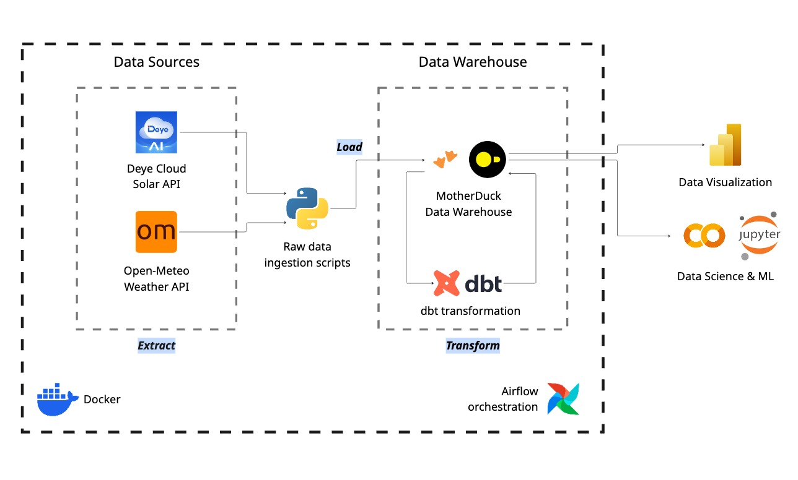
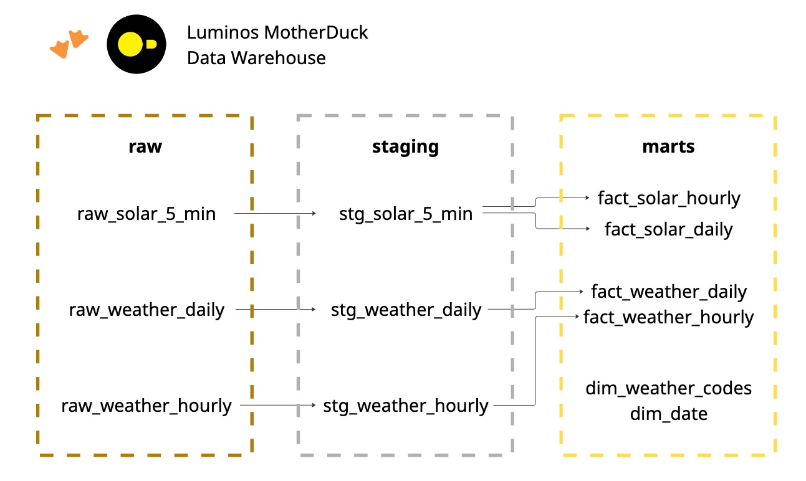

# luminos

**luminos** is an automated data platform that ingests solar energy metrics and weather data, transforms them into analytics-ready datasets, and enables monitoring and forecasting of generated solar energy performance.

if you are interested in working with residential solar energy generation data, i have made my dataset public. you can access it here:

[solar energy generation and weather data](https://www.kaggle.com/datasets/christiancanillas/solar-energy-generation-and-weather-data)

## architecture



## data lineage



## features

- **automated daily ingestion**: scheduled data collection at 2 am gmt+8
- **historical backfilling**: flexible date-range backfill capability
- **data quality tests**: automated validation via dbt tests
- **multi-grain analysis**: 5-minute raw → hourly → daily → monthly aggregations

## project structure
```
luminos/
├── .env.example                # Template for environment variables
├── docker-compose.yaml         # Airflow services configuration
├── pyproject.toml              # Python dependencies
├── README.md                   # This file
│
├── ingest/                     # Data ingestion layer
│   ├── client/                 # API clients
│   │   ├── deye_api.py         # Deye Cloud API client
│   │   └── openmeteo_api.py    # Open-Meteo API client
│   ├── extract/                # Data extractors
│   │   ├── solar.py            # Solar data extraction & transformation
│   │   └── weather.py          # Weather data extraction & transformation
│   ├── jobs/                   # Airflow job definitions
│   │   ├── daily_solar_job.py
│   │   ├── daily_weather_job.py
│   │   ├── backfill_solar_job.py
│   │   └── backfill_weather_job.py
│   ├── load/                   # Data loaders
│   │   └── duckdb_loader.py    # DuckDB loading logic
│   ├── utils/
│   │   ├── dates.py
│   │   └── logging.py
│   └── config.py               # Configuration management
│
├── transform/                  # dbt transformation layer
│   ├── dbt_project.yml
│   ├── profiles.yml            # DuckDB/MotherDuck connection config
│   ├── models/
│   │   ├── staging/            # Type casting & cleaning (views)
│   │   ├── marts/              # Core dimensional model (tables)
│   │   │   ├── dimensions/     # dim_date, dim_weather_codes
│   │   │   └── facts/          # Solar & weather facts
│   │   └── reports/            # Analysis-ready views (OBTs)
│   └── seeds/
│       └── wmo_weather_codes.csv
│
└── orchestration/              # Airflow orchestration
    ├── dags/                   # DAG definitions
    │   ├── daily_pipeline.py
    │   └── backfill_pipeline.py
    ├── config/
    │   └── airflow.cfg
    ├── logs/                   # Task execution logs
    └── plugins/
```


## if you want to setup locally

### prerequisities
- docker & docker compose installed
- python 3.10+
- motherduck account
- deye cloud api credentials

### setup
1. create environment file
```
cp .env.example .env
# edit .env using your credentials
```

2. start airflow
```
docker-compose up airflow-init
docker-compose up -d
```

3. access airflow ui
```
url: http://localhost:8080
username: (from _AIRFLOW_WWW_USER_USERNAME in .env)
password: (from _AIRFLOW_WWW_USER_PASSWORD in .env)
```

### local development
#### local dbt development
since `profiles.yml` defaults to `prod` (MotherDuck), use --target dev for local development:

```
# run models locally
uv run dbt run --project-dir transform --target dev

# run tests
uv run dbt test --project-dir transform --target dev

# generate documentation
uv run dbt docs generate --project-dir transform --target dev
uv run dbt docs serve --project-dir transform --target dev
```

#### running jobs locally (without airflow):
```
# install uv first
pip install uv

# sync all dependencies
uv sync

# solar job
uv run python -m ingest.jobs.daily_solar_job

# weather job
uv run python -m ingest.jobs.daily_weather_job

# backfills
uv run python -m ingest.jobs.backfill_solar_job --start-date YYYY-MM-DD --end-date YYYY-MM-DD
uv run python -m ingest.jobs.backfill_weather_job --start-date YYYY-MM-DD --end-date YYYY-MM-DD
```